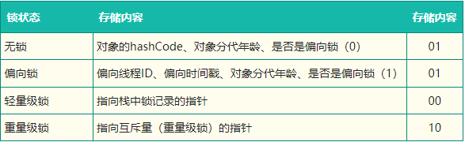

# JAVA基础


## 1. 泛型擦除相关

**泛型信息只存在于代码编译阶段，在进入 `JVM` 之前，与泛型相关的信息会被擦除掉。**

在泛型类被类型擦除的时候，之前泛型类中的类型参数部分如果没有指定上限，如 `<T>` 则会被转译成普通的 `Object` 类型，如果指定了上限如`<T extends String>` 则类型参数就被替换成类型上限。

换句话说，虽然我们在代码中使用了泛型，但在编译后，所有的泛型类型都会被擦除掉，转而使用其对应的原始类型。这就是Java泛型的底层实现原理。这样设计的目的是为了兼容旧的JDK版本，使得Java具有了较好的向后兼容性，旧的非泛型代码可以直接使用[泛型类库](https://www.zhihu.com/search?q=泛型类库&search_source=Entity&hybrid_search_source=Entity&hybrid_search_extra={"sourceType"%3A"answer"%2C"sourceId"%3A3090233220})，而不需要进行任何修改。同时，Java也提供了[反射机制](https://www.zhihu.com/search?q=反射机制&search_source=Entity&hybrid_search_source=Entity&hybrid_search_extra={"sourceType"%3A"answer"%2C"sourceId"%3A3090233220})来操作泛型类型，使得泛型类型在某些情况下还是可以被获取到的，所以即使有泛型擦除，仍然也不会太影响Java虚拟机的运行时效率。

**泛型擦除带来的限制**

在编译之后，这个泛型类的类型参数T就会被擦除，成为其对应的原始类型Object。这也意味着，我们无法在运行时获取到泛型的实际类型参数，所以泛型擦除的使用会有一些限制。首先由于[泛型类型参数](https://www.zhihu.com/search?q=泛型类型参数&search_source=Entity&hybrid_search_source=Entity&hybrid_search_extra={"sourceType"%3A"answer"%2C"sourceId"%3A3090233220})被擦除了，因此我们在运行时就无法获得泛型类型参数的信息。

- 无法使用基本类型实例化类型参数；

Java泛型中的类型参数不能是基本类型，只能是类或接口类型。例如，以下代码在编译阶段会出错，无法通过编译：

- 无法在运行时获取泛型类型信息；

由于泛型擦除的存在，导致我们在程序运行时无法获取泛型类型的信息。：


- 泛型类型参数不能用于[静态变量](https://www.zhihu.com/search?q=静态变量&search_source=Entity&hybrid_search_source=Entity&hybrid_search_extra={"sourceType"%3A"answer"%2C"sourceId"%3A3090233220})或静态方法；
- 不能实例化T类型。

## 2. final/finally/finalize的使用

final   类不可继承  方法不可重写  变量不可修改

finally  在try-catch中，finally 则是Java保证重点代码一定要被执行的一种机制。

finalize是Object类的一个方法，在垃圾收集器执行的时候会调用被回收对象的此方法，供垃圾收集时的其他资源回收，例如关闭文件等。

# JUC

## 1. Java实现线程同步的方式

- 使用synchronized关键字：由于每个java对象都有一个内置锁，用synchronized修饰方法或者代码块时，内置锁会保护整个方法或代码块，要想执行这个方法或者代码块必须获得其内置锁，运行时会加上内置锁，当运行结束时，内置锁会打开。
- wait与notify的方法
- **volatile关键字**   ： 保证所有线程看到某个变量的值是一致的，即线程每次使用变量前都会从主内存重新读取变量的值。但是，`volatile`不能保证复合操作的原子性。
- **Lock接口及其实现类**  使用RennntrantLock锁
- **使用并发容器**
- .ThreadLocal实现线程同步


## 2. ConcurrentHashMap为什么线程安全

HashTable实现线程安全的代价比较大，那就是所有有可能产生竞争的方法里都加上了synchronized,这就导致在出现竞争时，只能一个线程对整个HashTable进行操作，其他线程都需要阻塞等待当前取到锁的线程执行完成，这样效率非常低。

**JDK1.7版本的ConcurrentHashMap采用分段锁的形式**，每一段分一个Segment类，他内部类似HashMap的结构，内部有一个Entry数组，数组的每一个元素是一个链表，同时Segment继承自ReentrantLock。

在HashEntry中采用volatile来修饰，HashEntry的当前值和next元素的值。所以get方法在获取数据的时候是不需要加锁的，这样就大大提高了执行效率

在执行put()方法的时候先尝试获取锁（tryLock()）,如果获取失败，说明存在竞争，那么通过scanAndLockForPut()方法自旋，当自旋次数达到MAX_SCAN_RETRIES时会执行阻塞锁，直到获取锁成功。

在JDK1.8版本中采用了CAS+synchronized的方法来保证并发，线程安全


## 3. 线程池

优点：

- 降低资源消耗（防止线程频繁的创建和销毁）  通过重复利用已经创建的线程降低线程创建和销毁造成的消耗
- 提高响应速度（无须创建线程，直接用）当任务到达时，任务可以不需要等到线程创建就能立即执行
- 提高线程的可管理性     线程是稀缺资源，如果无限制的创建，不仅会消耗系统资源，还会降低系统的稳定性，使用线程池可以进行统一的分配，调优和监控。

**`ThreadPoolExecutor`**的参数

- **`corePoolSize` :** 任务队列未达到队列容量时，最大可以同时运行的线程数量。
- **`workQueue`:** 新任务来的时候会先判断当前运行的线程数量是否达到核心线程数，如果达到的话，新任务就会被存放在队列中。
- **`maximumPoolSize` :** 任务队列中存放的任务达到队列容量的时候，当前可以同时运行的线程数量变为最大线程数。
- **`keepAliveTime`**:线程池中的线程数量大于 `corePoolSize` 的时候，如果这时没有新的任务提交，核心线程外的线程不会立即销毁，而是会等待，直到等待的时间超过了 `keepAliveTime`才会被回收销毁。
- **`unit`** : `keepAliveTime` 参数的时间单位。
- **`threadFactory`** :executor 创建新线程的时候会用到。
- **`handler`** :饱和策略。关于饱和策略下面单独介绍一下


## 4. python、golang、java、c++如何选择？各有什么优缺点！


python: 

**简洁易读：** Python拥有清晰简洁的语法，易于学习和理解。  

**广泛应用：** 用于Web开发、数据分析、人工智能、科学计算等领域。

**强大的生态系统：** 有丰富的第三方库和框架（如Django、Flask、NumPy等）。

**高效开发：** Python的快速开发周期有助于快速迭代和原型设计。

**性能较低：** 相对于诸如C++和Golang等编译型语言，Python通常运行速度较慢。

多线程效率比较慢


go : 

**并发性能：** Golang内置支持轻量级线程（goroutines）和通道（channels），使得编写并发程序更加容易。

**性能良好：** Golang编译成本地机器码，性能较好。、

**静态类型检查：** 静态类型检查有助于减少错误，并提高代码的可维护性。

**简单的并发模型：** Golang的并发模型设计简洁明了，易于理解和使用。

**相对较小的生态系统：** 虽然Golang的生态系统在不断增长，但仍然相对Python和Java较小。

错误处理方式：


java:

**跨平台性：** Java程序可以在不同的操作系统上运行，具有很好的可移植性。

**强大的生态系统：** Java拥有庞大的标准库和丰富的第三方库，支持广泛的应用领域。

**多线程支持：** Java提供了强大的多线程支持，适用于并发编程。

**稳定性：** Java经过长时间的发展和优化，具有较高的稳定性和成熟性。

**相对较慢的启动速度：** Java应用程序通常启动较慢，占用较多的内存。

**冗长的语法：** Java的语法相对于Python和Golang来说比较冗长，可能需要更多的代码行数来表达相同的逻辑。


c++:

**高性能：** C++是一种编译型语言，生成的机器码执行速度快。

**控制能力：** C++提供了对底层硬件的更多控制，适用于系统编程和嵌入式开发。

**丰富的库：** C++拥有大量的库和工具，支持广泛的应用领域。

**内存管理复杂：** C++需要手动管理内存，容易引发内存泄漏和段错误等问题。

**相对繁琐的语法：** C++的语法相对较复杂，需要更多的代码量来表达相同的逻辑。


## 5. JAVA的锁

https://tech.meituan.com/2018/11/15/java-lock.html

Java提供了种类丰富的锁，每种锁因其特性的不同，在适当的场景下能够展现出非常高的效率。


### 5.1 乐观锁与悲观锁

乐观锁与悲观锁是一种广义上的概念，体现了看待线程同步的不同角度。在Java和数据库中都有此概念对应的实际应用。

先说概念。对于同一个数据的并发操作，悲观锁认为自己在使用数据的时候一定有别的线程来修改数据，因此在获取数据的时候会先加锁，确保数据不会被别的线程修改。Java中，synchronized关键字和Lock的实现类都是悲观锁。

而乐观锁认为自己在使用数据时不会有别的线程修改数据，所以不会添加锁，只是在更新数据的时候去判断之前有没有别的线程更新了这个数据。如果这个数据没有被更新，当前线程将自己修改的数据成功写入。如果数据已经被其他线程更新，则根据不同的实现方式执行不同的操作（例如报错或者自动重试）。

乐观锁在Java中是通过使用无锁编程来实现，最常采用的是CAS算法，Java原子类中的递增操作就通过CAS自旋实现的。

```
// ------------------------- 悲观锁的调用方式 -------------------------
// synchronized
public synchronized void testMethod() {
	// 操作同步资源
}
// ReentrantLock
private ReentrantLock lock = new ReentrantLock(); // 需要保证多个线程使用的是同一个锁
public void modifyPublicResources() {
	lock.lock();
	// 操作同步资源
	lock.unlock();
}

// ------------------------- 乐观锁的调用方式 -------------------------
private AtomicInteger atomicInteger = new AtomicInteger();  // 需要保证多个线程使用的是同一个AtomicInteger
atomicInteger.incrementAndGet(); //执行自增
```


### 5.2 自旋锁 VS 适应性自旋锁

是否让出CPU：自旋锁和非自旋锁

阻塞或唤醒一个Java线程需要操作系统切换CPU状态来完成，这种状态转换需要耗费处理器时间。如果同步代码块中的内容过于简单，状态转换消耗的时间有可能比用户代码执行的时间还要长。

在许多场景中，同步资源的锁定时间很短，为了这一小段时间去切换线程，线程挂起和恢复现场的花费可能会让系统得不偿失。如果物理机器有多个处理器，能够让两个或以上的线程同时并行执行，我们就可以让后面那个请求锁的线程不放弃CPU的执行时间，看看持有锁的线程是否很快就会释放锁。

而为了让当前线程“稍等一下”，我们需让当前线程进行自旋，如果在自旋完成后前面锁定同步资源的线程已经释放了锁，那么当前线程就可以不必阻塞而是直接获取同步资源，从而避免切换线程的开销。这就是自旋锁。

自旋锁本身是有缺点的，它不能代替阻塞。自旋等待虽然避免了线程切换的开销，但它要占用处理器时间。如果锁被占用的时间很短，自旋等待的效果就会非常好。反之，如果锁被占用的时间很长，那么自旋的线程只会白浪费处理器资源。所以，自旋等待的时间必须要有一定的限度，如果自旋超过了限定次数（默认是10次，可以使用-XX:PreBlockSpin来更改）没有成功获得锁，就应当挂起线程。

自旋锁的实现原理同样也是CAS，AtomicInteger中调用unsafe进行自增操作的源码中的do-while循环就是一个自旋操作，如果修改数值失败则通过循环来执行自旋，直至修改成功。


### 5.3 无锁 VS 偏向锁 VS 轻量级锁 VS 重量级锁

这四种锁是指锁的状态，专门针对synchronized的。

synchronized是悲观锁，在操作同步资源之前需要给同步资源先加锁，这把锁就是存在Java对象头里的.

**Mark Word**：默认存储对象的HashCode，分代年龄和锁标志位信息。这些信息都是与对象自身定义无关的数据，所以Mark Word被设计成一个非固定的数据结构以便在极小的空间内存存储尽量多的数据。它会根据对象的状态复用自己的存储空间，也就是说在运行期间Mark Word里存储的数据会随着锁标志位的变化而变化。

**Klass Point**：对象指向它的类元数据的指针，虚拟机通过这个指针来确定这个对象是哪个类的实例。

Monitor可以理解为一个同步工具或一种同步机制，通常被描述为一个对象。每一个Java对象就有一把看不见的锁，称为内部锁或者Monitor锁。

Monitor是线程私有的数据结构，每一个线程都有一个可用monitor record列表，同时还有一个全局的可用列表。每一个被锁住的对象都会和一个monitor关联，同时monitor中有一个Owner字段存放拥有该锁的线程的唯一标识，表示该锁被这个线程占用。




**无锁**

无锁没有对资源进行锁定，所有的线程都能访问并修改同一个资源，但同时只有一个线程能修改成功。

无锁的特点就是修改操作在循环内进行，线程会不断的尝试修改共享资源。如果没有冲突就修改成功并退出，否则就会继续循环尝试。如果有多个线程修改同一个值，必定会有一个线程能修改成功，而其他修改失败的线程会不断重试直到修改成功。上面我们介绍的CAS原理及应用即是无锁的实现。无锁无法全面代替有锁，但无锁在某些场合下的性能是非常高的。

**偏向锁**

偏向锁是指一段同步代码一直被一个线程所访问，那么该线程会自动获取锁，降低获取锁的代价。

在大多数情况下，锁总是由同一线程多次获得，不存在多线程竞争，所以出现了偏向锁。其目标就是在只有一个线程执行同步代码块时能够提高性能。

当一个线程访问同步代码块并获取锁时，会在Mark Word里存储锁偏向的线程ID。在线程进入和退出同步块时不再通过CAS操作来加锁和解锁，而是检测Mark Word里是否存储着指向当前线程的偏向锁。引入偏向锁是为了在无多线程竞争的情况下尽量减少不必要的轻量级锁执行路径，因为轻量级锁的获取及释放依赖多次CAS原子指令，而偏向锁只需要在置换ThreadID的时候依赖一次CAS原子指令即可。

偏向锁只有遇到其他线程尝试竞争偏向锁时，持有偏向锁的线程才会释放锁，线程不会主动释放偏向锁。偏向锁的撤销，需要等待全局安全点（在这个时间点上没有字节码正在执行），它会首先暂停拥有偏向锁的线程，判断锁对象是否处于被锁定状态。撤销偏向锁后恢复到无锁（标志位为“01”）或轻量级锁（标志位为“00”）的状态。

偏向锁在JDK 6及以后的JVM里是默认启用的。可以通过JVM参数关闭偏向锁：-XX:-UseBiasedLocking=false，关闭之后程序默认会进入轻量级锁状态。

**轻量级锁**

是指当锁是偏向锁的时候，被另外的线程所访问，偏向锁就会升级为轻量级锁，其他线程会通过自旋的形式尝试获取锁，不会阻塞，从而提高性能。

在代码进入同步块的时候，如果同步对象锁状态为无锁状态（锁标志位为“01”状态，是否为偏向锁为“0”），虚拟机首先将在当前线程的栈帧中建立一个名为锁记录（Lock Record）的空间，用于存储锁对象目前的Mark Word的拷贝，然后拷贝对象头中的Mark Word复制到锁记录中。

拷贝成功后，虚拟机将使用CAS操作尝试将对象的Mark Word更新为指向Lock Record的指针，并将Lock Record里的owner指针指向对象的Mark Word。

如果这个更新动作成功了，那么这个线程就拥有了该对象的锁，并且对象Mark Word的锁标志位设置为“00”，表示此对象处于轻量级锁定状态。

如果轻量级锁的更新操作失败了，虚拟机首先会检查对象的Mark Word是否指向当前线程的栈帧，如果是就说明当前线程已经拥有了这个对象的锁，那就可以直接进入同步块继续执行，否则说明多个线程竞争锁。

若当前只有一个等待线程，则该线程通过自旋进行等待。但是当自旋超过一定的次数，或者一个线程在持有锁，一个在自旋，又有第三个来访时，轻量级锁升级为重量级锁。

**重量级锁**

升级为重量级锁时，锁标志的状态值变为“10”，此时Mark Word中存储的是指向重量级锁的指针，此时等待锁的线程都会进入阻塞状态。


### 5.4 公平锁 VS 非公平锁

公平锁是指多个线程按照申请锁的顺序来获取锁，线程直接进入队列中排队，队列中的第一个线程才能获得锁。公平锁的优点是等待锁的线程不会饿死。缺点是整体吞吐效率相对非公平锁要低，等待队列中除第一个线程以外的所有线程都会阻塞，CPU唤醒阻塞线程的开销比非公平锁大。

非公平锁是多个线程加锁时直接尝试获取锁，获取不到才会到等待队列的队尾等待。但如果此时锁刚好可用，那么这个线程可以无需阻塞直接获取到锁，所以非公平锁有可能出现后申请锁的线程先获取锁的场景。非公平锁的优点是可以减少唤起线程的开销，整体的吞吐效率高，因为线程有几率不阻塞直接获得锁，CPU不必唤醒所有线程。缺点是处于等待队列中的线程可能会饿死，或者等很久才会获得锁。

ReentrantLock里面有一个内部类Sync，Sync继承AQS（AbstractQueuedSynchronizer），添加锁和释放锁的大部分操作实际上都是在Sync中实现的。它有公平锁FairSync和非公平锁NonfairSync两个子类。ReentrantLock默认使用非公平锁，也可以通过构造器来显示的指定使用公平锁。


再进入hasQueuedPredecessors()，可以看到该方法主要做一件事情：主要是判断当前线程是否位于同步队列中的第一个。如果是则返回true，否则返回false。

综上，公平锁就是通过同步队列来实现多个线程按照申请锁的顺序来获取锁，从而实现公平的特性。非公平锁加锁时不考虑排队等待问题，直接尝试获取锁，所以存在后申请却先获得锁的情况。


### 5.5 可重入锁 VS 非可重入锁

可重入锁又名递归锁，是指在同一个线程在外层方法获取锁的时候，再进入该线程的内层方法会自动获取锁（前提锁对象得是同一个对象或者class），不会因为之前已经获取过还没释放而阻塞。Java中ReentrantLock和synchronized都是可重入锁，可重入锁的一个优点是可一定程度避免死锁。下面用示例代码来进行分析：

```
public class Widget {
    public synchronized void doSomething() {
        System.out.println("方法1执行...");
        doOthers();
    }

    public synchronized void doOthers() {
        System.out.println("方法2执行...");
    }
}
```

在上面的代码中，类中的两个方法都是被内置锁synchronized修饰的，doSomething()方法中调用doOthers()方法。因为内置锁是可重入的，所以同一个线程在调用doOthers()时可以直接获得当前对象的锁，进入doOthers()进行操作。

如果是一个不可重入锁，那么当前线程在调用doOthers()之前需要将执行doSomething()时获取当前对象的锁释放掉，实际上该对象锁已被当前线程所持有，且无法释放。所以此时会出现死锁。

ReentrantLock和synchronized都是重入锁


### 5.6 独享锁 VS 共享锁

独享锁和共享锁同样是一种概念。我们先介绍一下具体的概念，然后通过ReentrantLock和ReentrantReadWriteLock的源码来介绍独享锁和共享锁。

独享锁也叫排他锁，是指该锁一次只能被一个线程所持有。如果线程T对数据A加上排它锁后，则其他线程不能再对A加任何类型的锁。获得排它锁的线程即能读数据又能修改数据。JDK中的synchronized和JUC中Lock的实现类就是互斥锁。

共享锁是指该锁可被多个线程所持有。如果线程T对数据A加上共享锁后，则其他线程只能对A再加共享锁，不能加排它锁。获得共享锁的线程只能读数据，不能修改数据。

独享锁与共享锁也是通过AQS来实现的，通过实现不同的方法，来实现独享或者共享。


## 6. AQS

AQS 的全称为 `AbstractQueuedSynchronizer` ，翻译过来的意思就是抽象队列同步器。

AQS 核心思想是，如果被请求的共享资源空闲，则将当前请求资源的线程设置为有效的工作线程，并且将共享资源设置为锁定状态。如果被请求的共享资源被占用，那么就需要一套线程阻塞等待以及被唤醒时锁分配的机制，这个机制 AQS 是用 **CLH 队列锁** 实现的，即将暂时获取不到锁的线程加入到队列中。


## 7 java 死锁的排查

```
C:\Users\dell>jps -l
6276
19064 org.jetbrains.jps.cmdline.Launcher
26616 DeadLockTest
18140 sun.tools.jps.Jps


C:\Users\dell>jstack 26616

"B":
        at DeadLockTest.lambda$main$1(DeadLockTest.java:30)
        - waiting to lock <0x000000076be18c08> (a java.lang.Object)
        - locked <0x000000076be18c18> (a java.lang.Object)
        at DeadLockTest$$Lambda$2/1324119927.run(Unknown Source)
        at java.lang.Thread.run(Thread.java:748)
"A":
        at DeadLockTest.lambda$main$0(DeadLockTest.java:16)
        - waiting to lock <0x000000076be18c18> (a java.lang.Object)
        - locked <0x000000076be18c08> (a java.lang.Object)
        at DeadLockTest$$Lambda$1/295530567.run(Unknown Source)
        at java.lang.Thread.run(Thread.java:748)
```


jstack命令可以生成JVM当前时刻的线程快照。线程快照是当前JVM内每一条线程正在执行的方法堆栈的集合，生成线程快照的主要目的是**定位线程出现长时间停顿的原因**，如**线程间死锁、死循环、请求外部资源导致的长时间等待**等

## 8. sleep 和 wait的区别

sleep是Thread线程类的静态方法，而wait是Object顶级类的普通方法

sleep()方法导致了程序暂停执行指定的时间，让出cpu给其他线程，但是他的监控状态依然保持，当指定的时间到了又会自动恢复运行状态。
在调用sleep()方法的过程中，线程不会释放对象锁。
调用wait()方法的时候，线程会释放对象锁，进入等待此对象的等待锁定池，只有针对此对象调用notify()方法后本线程才进入对象锁定池准备。


## 9.ThreadLocal

又称为线程变量，意思是ThreadLocal中填充的变量属于当前线程，该变量对于其他线程而言是隔离的。

实际上 ThreadLocalMap 中使用的 key 为 ThreadLocal 的弱引用，弱引用的特点是，如果这个对象只存在弱引用，那么在下一次垃圾回收的时候必然会被清理掉。

当ThreadLocal对象不再使用时，使用弱引用可以让对象被回收；因为仅有弱引用没有强引用的情况下，对象是可以被回收的。

Java SE 1.6中，锁一共有4种状态，级别从低到高依次是：无锁状态、偏向锁状态、轻量级锁状态和重量级锁状态，这几个状态会随着竞争情况逐渐升级。锁可以升级但不能降级，意味着偏向锁升级成轻量级锁后不能降级成偏向锁。这种锁升级却不能降级的策略，目的是为了提高获得锁和释放锁的效率。对象的MarkWord变化为下图：


## 10. Synchronized理解

在 JVM（Java虚拟机） 中，对象在内存中分为三块区域：对象头、实例数据、对其填充

每一个JAVA对象都会与一个监视器monitor关联，我们可以把它理解成为一把锁，当一个线程想要执行一段被 synchronized 圈起来的同步方法或者代码块时，该线程得先获取到synchronized修饰的对象对应的monitor

因为监视器锁（monitor）是依赖于底层的操作系统的 Mutex Lock 来实现的，Java 的线程是映射到操作系统的原生线程之上的。如果要挂起或者唤醒一个线程，都需要操作系统帮忙完成，而操作系统实现线程之间的切换时需要从用户态转换到内核态，这个状态之间的转换需要相对比较长的时间，时间成本相对较高。

Monitor 被翻译为监视器或管程

每个 Java 对象都可以关联一个 Monitor 对象，如果使用 synchronized 给对象上锁（重量级）之后，该对象头的 Mark Word 中就被设置指向 Monitor 对象的指针


各种锁并不是相互代替的，而是在不同场景下的不同选择，绝对不是说重量级锁就是不合适的。每种锁是只能升级，不能降级，即由偏向锁->轻量级锁->重量级锁，而这个过程就是开销逐渐加大的过程。

> 如果是单线程使用，那偏向锁毫无疑问代价最小，并且它就能解决问题，连CAS都不用做，仅仅在内存中比较下对象头就可以了；
>
> 如果出现了其他线程竞争，则偏向锁就会升级为轻量级锁；
>
> 如果其他线程通过一定次数的CAS尝试没有成功，则进入重量级锁；


# JVM


## 1. jvm内存模型，gc的具体过程


## 2. java类加载过程  有哪些类加载器

1.加载

加载阶段是将类的字节码文件加载到内存中，并创建一个对应的Class对象。加载阶段由类加载器(ClassLoader)完成。类加载器根据类的全限定名查找并读取类的字节码文件，然后将其转换为内部数据结构，并创建一个Class对象来表示这个类。

2.验证

验证阶段会对字节码进行验证，以确保其符合Java虚拟机规范。验证过程包括检查字节码的结构、语义以及符号引用的合法性等。验证阶段的目的是确保加载的类能够安全、正确地执行。

3.准备

准备阶段是为类的静态变量分配内存空间，并设置默认初始值。静态变量属于类本身而不是对象，所以在准备阶段，虚拟机会为这些静态变量分配内存，并设置默认值。

4.解析

解析阶段将符号引用转换为直接引用。在Java代码中，使用符号引用来引用类、字段、方法等，而直接引用是可以直接指向内存中的数据结构的指针或者偏移量。解析阶段的主要目的是将符号引用解析为可直接使用的直接引用。

5.初始化

初始化阶段是对类的静态变量进行赋值和静态代码块的执行。在这个阶段，虚拟机会按照程序员指定的顺序执行类的静态变量赋值和静态代码块中的代码。初始化阶段是类加载过程的最后一个阶段，也是类被真正使用之前的最后准备工作。


## 3. CMS垃圾回收器

基于`标记-清除`算法，老年代垃圾收集器

GC过程短暂停，适合对时延要求较高的服务，用户线程不允许长时间的停顿。

## 4. G1垃圾回收器

G1 是一个并行回收器，他把堆内存分割喂很多不相关的区域（Region物理上不连续），默认把推分为2048个区域，每一个Region的大小是1-32M不等，但必须是2的整数次幂。使用不同的Region可以表示Eden、Survivor From、Survivor To、老年代等。

由于侧重于回收垃圾最大量的区间，所以把此收集器取名为Garbage First

官方给G1设定的目标是在延迟可控的情况下，获得尽可能高的吞吐量。