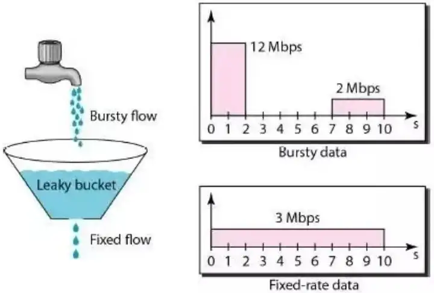
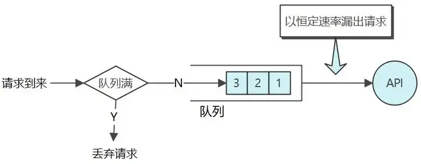

# 分布式

## 1. 一致性哈希

在分布式系统中，数据的存储和访问是很重要的问题。为了提高系统的可用性和扩展性，常常需要将数据分布到不同的节点上，而且这些节点也可能会动态地加入或离开集群。一致性哈希算法就是一种常用的解决方案，它可以解决节点的动态变化和负载均衡的问题。

一致性哈希算法是一种用于分布式系统中的数据分片和负载均衡的算法。它将整个哈希空间划分为一个环，并且每个节点在这个环上都有一个对应的位置。当需要读写某个数据时，先将其进行哈希运算得到一个哈希值，然后根据这个哈希值在环上找到对应的节点，从而实现数据的定位。

一致性哈希算法的优点在于：当新增或删除节点时，只会影响到环上的一小部分节点，因此不会像传统的哈希算法那样造成大量的数据迁移和重新分片。同时，由于节点数较多，请求可以被更好地平均分配，从而实现了负载均衡的效果。

**引入虚拟节点来解决负载不均衡的问题**：即将每台物理服务器虚拟为一组虚拟服务器，将虚拟服务器放置到哈希环上，如果要确定对象的服务器，需先确定对象的虚拟服务器，再由虚拟服务器确定物理服务器；


## 2. CAP定理

对于一个分布式的计算系统来说，不可能同时满足以下三点：

- Consistency(一致性) ：数据在多个副本之间能够保持一致的特性
- Availability（可用性）：指系统提供的服务必须一致处于可用的状态，每次请求都能获取到非错误的响应
- Partition tolerance（分区容错性）：分布式系统在遇到任何网络分区故障的时候，仍然可以接受请求

强一致性：任何一次读都能读到某个数据的最近一次写的数据。系统中的所有进程，看到的操作顺序，都和全局时钟下的顺序一致。简言之，在任意时刻，所有节点中的数据是一样的。

最终一致性 :不保证在任意时刻任意节点上的同一份数据都是相同的，但是随着时间的迁移，不同节点上的同一份数据总是在向趋同的方向变化。


## 3.Base理论

Base 是三个短语的简写，即基本可用（Basically Available）、软状态（Soft State）和最终一致性（Eventually Consistent）。


>2008 年 Dan Pritchett 提出一个与两阶段提交截然不同的分布式事务理论: BASE（Basically Available，Soft state，Eventually consistent）理论。BASE 理论打破了传统解决分布式事务的思维，放弃 ACID 特性以换取系统的可用性，BASE 理论强调基本可用、软状态、最终一致，而不像 ACID 坚持强一致性。**BASE 理论是一种处理分布式事务的思想，没有具体的操作步骤，要理解 BASE 理论需要结合具体的例子**。”


==基本可用 BA==：不追求 CAP 中的「任何时候，读写都是成功的」，而是系统能够基本运行，一直提供服务。基本可用强调了分布式系统在出现不可预知故障的时候，允许损失部分可用性，相比正常的系统，可能是响应时间延长，或者是服务被降级。

是鼓励通过预先的架构设计或者前期规划，尽量在分布式的系统中，**把以前可能影响全平台的严重问题，变成只会影响平台中的一部分数据或者功能的非严重问题。**


==软状态==：软状态可以对应 ACID 事务中的原子性，在 ACID 的事务中，实现的是强制一致性，要么全做要么不做，所有用户看到的数据一致。其中的原子性（Atomicity）要求多个节点的数据副本都是一致的，强调数据的一致性。原子性可以理解为一种“硬状态”，软状态则是允许系统中的数据存在中间状态，并认为该状态不影响系统的整体可用性，即允许系统在多个不同节点的数据副本存在数据延时。


==**最终一致性**==：不保证在任意时刻任意节点上的同一份数据都是相同的，但是随着时间的迁移，不同节点上的同一份数据总是在向趋同的方向变化。


BASE 理论本质上只是一种架构思想，它告诉人们世界上还存在着这么一些事情：

1. 能通过巧妙地设计，通过局部轻微的损失减少全局严重的损失；
2. 能通过一些解耦、异步、推迟执行、批量执行等技巧，构造出一种中间状态，从而提高系统的整体性能；
3. 平台是为业务服务的，业务的核心是数据状态，而数据状态无论中间变成什么样，最终还要恢复到它应该处于的正确状态。

# 开发经验

## 1. CPU占用率过高的原因

原因：可能是业务代码死循环、GC频繁、线程竞争条件、死锁、阻塞等问题等

```text
cpu占用率高，将会导致系统运行变慢，这种情况可能的原因主要有两种：
1.代码中某个位置读取数据量较大，导致系统内存耗尽，从而导致Full GC次数过多，系统缓慢；
2.代码中有比较耗CPU的操作，导致CPU占用增高，系统运行缓慢；

另外有几种情况也会导致某个功能运行缓慢，但是不至于导致系统不可用：
1.代码某个位置有阻塞性的操作，导致该功能调用整体比较耗时，但出现是比较随机的；
2.某个线程由于某种原因而进入WAITING状态，此时该功能整体不可用，但是无法复现；
3.由于锁使用不当，导致多个线程进入死锁状态，从而导致系统整体比较缓慢。
对于这三种情况，通过查看CPU和系统内存情况是无法查看出具体问题的，因为它们相对来说都是具有一定阻塞性操作，CPU和系统内存使用情况都不高，但是功能却很慢。下面我们就通过查看系统日志来一步一步甄别上述几种问题。
```

排查步骤：ps 获取进程ID ;查找进程中cpu使用率较高的线程 ps -mp pid -o THREAD, tid, time; 使用jdk jstack命令查看线程堆栈信息;定位线程;


## 2. 限流怎么做

限流在确保现代分布式系统的稳定运行中，发挥了至关重要的作用。

限流是一种限制请求速率的技术。通常用于保护服务自身，或者在下游服务已知无法保护自身的情况下，保护下游服务。

目的：

- 防止资源枯竭，提高服务的可用性
- 管理配额，对每个用户使用限流，从而为每个用户提供公平的服务，而不影响其他用户。
- 费率控制：在按使用付费模式中，底层资源能够自动伸缩满足需求，限流通过对资源拓展设置虚拟上线来帮助控制运营成本


### 2.1 限制键

本质上是一个用于计数的标识，也就是限流算法所作用的对象。比如当基于IP或者用户进行限流，这里的IP地址或者用户ID就是一个限制键

理论上，任何可从请求中提取的特征都可以用作限制键，比如IP、用户、地区、API Key


### 2.2 限流算法

Allow a key to make x requests per y time period

#### 漏桶

控制数据注入到网络的速率，平滑网络上的突发流量。



算法过程：

- 漏桶由一个有限长度的FIFO队列组成
- 当一个请求到达时，如果队列中有空间，他就被附加到队列中，否则将被拒绝
- 队列的另一端，则以一个恒定的速率漏出/放行




优点：能够平滑突发流量，使得漏桶算法特别适合需要削峰填谷的瞬时高并发场景

缺点：

- 资源利用率低、不能高效低利用可用的资源。因为它只在固定的时间间隔放行请求，所以在很多情况下，流量非常低的时候无法有效消耗资源。
- 饥饿问题：当短时间有当量突发请求，即使服务器没有任何负载，每个请求也需要在队列中等待一段时间


#### 令牌桶

算法过程：

- 算法使用一个固定容量的桶
- 只要桶不满，系统以一个恒定速率向桶中添加令牌
- 当请求到来的时候，就可以从桶中拿走1个或多个令牌

优点：允许突发流量。


#### 简单计数

算法过程：

- 请求开始处理时，计数器加一
- 请求处理完毕时，计数器减一
- 若计数器超过阈值，则直接拒绝该请求

#### 固定窗口计数

