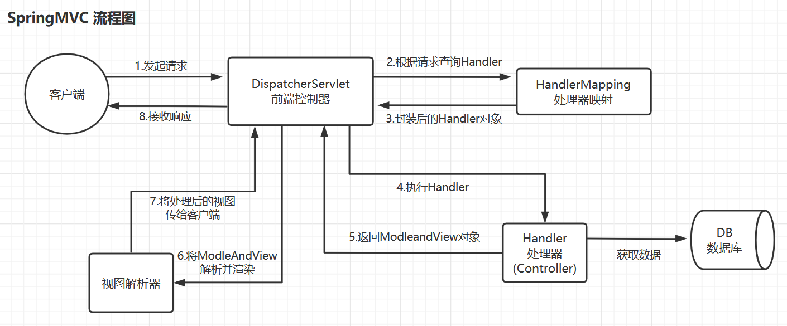

# Spring

## 1. 什么是Spring的loC和Dl?

**IOC:** Spring 反向控制应用程序需要的资源。
**DI:** 应用程序依赖Spring为其提供资源。

IOC：是一种设计思想，意味着将设计好的对象交给容器控制，而不是传统的在对象内部直接控制。IOC容器可以理解为一个对象工厂，我们将对象交给工厂来管理其创建和依赖关系，开发者只需要关注业务逻辑。  好处在于将对象集中统一管理并且降低耦合度。

DI：是IOC的实现方式，由容器动态的将某个依赖关系注入到组件之中

## 2. Spring事务的传播机制

保证一个事务在多个调用方法之间的可控性

1. REQUIRED 默认，存在事务就加入，否则创建新事务
2. SUPPORTS 存在加入，不存在就以非事务的方式运行
3. MANDATORY 存在加入，不存在事务则抛出异常
4. REQUIRED_NEW 创建新事物，如果当前存在则把当前事务挂起
5. NOT_SUPPROTS  非事务方式运行，存在事务则把当前事务挂起
6. NEVER 非事务方式运行，存在则抛出异常
7. NESTED 存在事务，则创建一个事务作为当前事务的嵌套事务运行，不存在则创建一个新事务

REQUIRED_NEW，内层事务与外层事务是两个独立事务，一旦内层事务提交后，外层事务不能对其进行回滚

NESTED，外层事务的回滚可以引起内层事务的回滚。而内层事务的异常不会导致外层事务的回滚

## 3. Spring事务的实现方式有哪些

- 编程式事务：通过编程的方式管理事务，灵活性好，但难以维护
- 声明式事务：将事务管理代码从业务方法中分离出来，通过aop进行封装。Spring声明式事务使得我们无需去处理获得连接、关闭连接、事务提交和回滚这些操作。使用`@Transactional` 注解开启声明式事务

## 4. Spring事务在什么情况下会失效

- 访问权限问题：必须为public，因为spring要求被代理方法必须是public的
- 方法用final修饰会失效，因为spring底层事务使用了aop，方法用final修饰导致代理类无法重写
- 对象没有被spring管理
- 表不支持事务，例如存储引擎使用myisam
- 方法内部调用，发生自身调用，而没有经过spring的代理类。解决办法：再声明一个service，将内部调用改为外部；使用编程式事务；使用aopcontext.currentProxy()来获取代理对象
- 未开启事务  spring配置
- 吞了异常，代码中手动catch了异常

## 5. SpringMVC工作流程

1. 用户发送http请求到diapatcherServlet，中途会有过滤器filter进行数据过滤。DispatcherServlet执行doService方法经过数据灌入后调用doDispatch方法，得到请求资源标识符（URI）
2. dispathcerServlet收到请求后调用handlerMapping处理器映射器，找到具体的Handler处理器，将其返回给dispatcherServlet
3. 处理器映射器 HandlerMapping 映射到对应的后端处理器 Handler（注意这里只是找到了对应的 Controller 类，并没有执行其中的方法），Handler 对象以及 Handler 对象相关的拦截器对象会被封装到 HandlerExecutionChain 对象中返回给 DispatcherServlet。

# SpringBoot

## 1. 为什么要有SpringBoot

Spring Boot 的诞生是为了简化Spring应用的开发和部署过程，专注于业务逻辑的实现。

## 2. @SpringBootApplication 注解

@SpringBootApplication 可以看做是@Configuration @EnableAutoConfiguration @ComponentScan

- @EnableAutoConfiguration : 启动SpringBoot的自动配置机制，允许SpringBoot根据项目的依赖和配置自动配置Spring应用的各个部分
- @ComponentScan ： 扫描被@Component(@Service、@Controller)注解的bean，注解默认会扫描该类所在包下的所有类
- @Configuration: 运行在上下文中注册额外的bean或导入其他配置类

