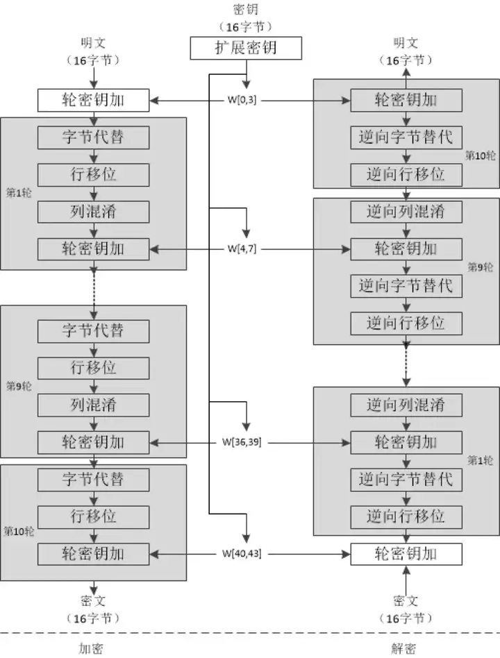
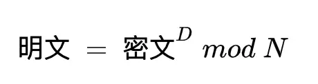

# Linux

s

# 操作系统

## 1. 协程

“轻量级线程”

进程/内核态线程切换的时候需要与OS内核进行交互，保存/读取 CPU 上下文信息。内核态（Kernel）的一些数据是共享的，读写时需要同步机制，所以操作一旦陷入内核态就会消耗更多的时间

进程需要与操作系统中所有其他进程进行资源争抢，且操作系统中资源的锁是全局的；线程之间的数据一般在进程内共享，所以线程间资源共享相比如进程而言要轻一些。

协程并没有增加线程的数量，只是在线程的基础上通过分时复用的方式运行多个协程，而且协程的切换在用户态完成，切换的代价比线程从用户态到内核态的代价小很多。

进程是资源分配的最小单位，每个进程都有自己独立的内存空间，进程是应用程序运行的载体，可以看做正在执行的程序。每个进程都有独立的代码和数据空间，进程之间的切换会有较大的开销

线程是CPU任务调度和执行的最小单位，一个进程中可以包含多个线程并发运行，共享进程提供的堆内存，每个线程都有自己独立的运行栈和程序计数器，线程之间切换的开销小。

协程，是一种用户态的轻量级线程，一个线程可以有多个协程。协程的调度完全由用户控制，有自己的寄存器，在线程的基础上通过分时复用的方式运行多个协程，没有基本的内核切换的开销，上下文切换非常快。

协程抽象于线程之上，线程是被分割的CPU资源, 协程是组织好的代码流程, 协程需要线程来承载运行。

## 2. 死锁的4个条件

1. 互斥条件：一个资源每次只能被一个进程使用，即资源仅能让一个进程使用而不支持进个线程同时使用。
2. 请求与保持条件：已经拥有资源的进程在请求其他资源时并没有释放当前资源，或者进程已经保持至少一个资源，但又提出了新的资源请求，而该资源已被其他进程占有，此时请求进程阻塞，但又对自己已获得的资源保持不放。
3. 不剥夺条件：已经获得的资源在自主释放前不能使用其他手段剥夺。
4. 循环等待条件：若干进程之间形成一种头尾相接的循环等待资源关系，即各个线程对资源的需求构成了一个循环。

## 3. 虚拟内存和物理内存

物理内存（Physical Memory）是计算机硬件上实际存在的内存单元，由随机存取存储器（RAM）组成。它是计算机直接访问的内存空间，用于存储程序和数据。

虚拟内存（Virtual Memory）是在物理内存的基础上，通过操作系统的管理，为每个进程提供了一个抽象的地址空间。虚拟内存使得每个进程可以拥有独立的地址空间，从而实现了内存的隔离和保护。

# 计网

## 1. 有了 IP 地址，为什么还要用 MAC 地址？

1. 早起的以太网的实现

早期的[以太网](https://www.zhihu.com/search?q=以太网&search_source=Entity&hybrid_search_source=Entity&hybrid_search_extra={"sourceType"%3A"answer"%2C"sourceId"%3A28155896})只有集线器（hub），没有交换机（switch），所以发出去的包能被以太网内的所有机器监听到，因此要附带上MAC地址，每个机器只需要接受与自己MAC地址相匹配的包。

2. 整体与局部

信息传递时候，需要知道的其实是两个地址：

- 终点地址（Final destination address）
- 下一跳的地址（Next hop address）

IP地址本质上是终点地址，它在跳过路由器（hop）的时候不会改变，而MAC地址则是下一跳的地址，每跳过一次路由器都会改变。

这就是为什么还要用MAC地址的原因之一，它起到了记录下一跳的信息的作用。

注：一般来说IP地址经过路由器是不变的，不过NAT（Network address translation）例外，这也是有些人反对NAT而支持IPV6的原因之一。

3. 分层实现

如果在IP包头（header）中增加了”下一跳IP地址“这个字段，在逻辑上来说，如果IP地址够用，交换机也支持根据IP地址转发（现在的[二层交换机](https://www.zhihu.com/search?q=二层交换机&search_source=Entity&hybrid_search_source=Entity&hybrid_search_extra={"sourceType"%3A"answer"%2C"sourceId"%3A28155896})不支持这样做），其实MAC地址并不是必要的。

但用MAC地址和IP地址两个地址，用于分别表示物理地址和逻辑地址是有好处的。这样分层可以使网络层与链路层的协议更灵活地替换，网络层不一定非要用『IP』协议，链路层也不一定非用『以太网』协议。

这就像OSI[七层模型](https://www.zhihu.com/search?q=七层模型&search_source=Entity&hybrid_search_source=Entity&hybrid_search_extra={"sourceType"%3A"answer"%2C"sourceId"%3A28155896})，TCP/IP五层模型其实也不是必要的，用双层模型甚至[单层模型](https://www.zhihu.com/search?q=单层模型&search_source=Entity&hybrid_search_source=Entity&hybrid_search_extra={"sourceType"%3A"answer"%2C"sourceId"%3A28155896})实现网络也不是不可以的，只是那样做很蛋疼罢了。

## 2. 为什么非对称加密比对称加密慢？

因为对称加密主要的运算是**位运算**，速度非常快，如果使用硬件计算，速度会更快。以 AES 算法为例，如下图所示，其运算本质上来说就是位移和替换。

但是非对称加密计算一般都比较复杂，比如 RSA，它里面涉及到大数乘法、大数模等等运算。其加解密可以用下面的公式来表示：

## 3. 为什么要有RPC

配合微服务解决高并发问题好处：

- 简化开发
- 提高性能
- 解耦模块
- 跨语言支持
- 提高系统可靠性

## 4. HTTP版本演变

HTTP1.1

- 使用长链接的方式改善了HTTP1.0短连接造成的性能开销
- 支持管道网络传输，只要第一个请求发出去了，不必等其回来，就可以发第二个请求出去，减少整体的响应时间，但服务器是按请求的顺序响应的，如果服务器响应慢，会导致客户端一直请求不到数据，造成队头阻塞。属于HTTP层的队头阻塞。

HTTP2

- 头部压缩，HPACK算法：客户端和服务端同时维护一张头信息表
- 二进制格式，头信息和数据体都是二进制，不像1.1里的纯文本形式
- 并发传输：stream概念，多个stream复用在一条TCP连接，针对不同的HTTP请求使用独一无二的StreamID来区分，不同Stream的帧是可以乱序发送的。虽然多个请求复用一个TCP连接解决了HTTP的队头阻塞，但是一旦丢包，就会阻塞住所有的HTTP请求，这是TCP层的队头阻塞。
- 服务器主动推送资源

HTTP3

HTTP3把HTTP下层的TCP协议改成了UDP。基于UDP的QUIC协议可以实现类似TCP的可靠传输

QUIC特点：

- 无队头阻塞：当某个流发生丢包的时候，只会阻塞这一个流，其他流不受影响
- 更快的连接建立
- 连接迁移

# 设计模式

## 1.命令模式

命令模式（Command Pattern）是一种行为型设计模式，也被称为动作模式或事务模式。它的核心思想是将一个请求封装成一个对象，从而使你可以用不同的请求对客户进行参数化。对请求排队或记录，以及支持可撤销的操作。命令模式的主要目的是将发出请求的对象和执行请求的对象解耦。

# 数据结构

## 1. 红黑树

红黑树（Red-Black Tree）也是是一种自平衡的二叉搜索树，与AVL树不同的是它在每个结点上增加一个存储位表示结点的颜色，可以是Red或Black。 通过对任何一条从根到叶子的路径上各个结点着色方式的限制，红黑树确保没有一条路径会比其他路径长出两倍（最长路径也不会超出最短路径的两倍，因此红黑树的平衡性要求相对宽松，没有AVL树那样严格），从而使搜索树达到一种相对平衡的状态。

特点：

1. 每个节点不是黑色就是红色
2. 根节点必须是黑色
3. 红色节点的两个子节点必须都是黑色，保证没有两个连续的红色节点相连
4. 每个叶子结点都是黑色（此处的叶子节点指的是空节点，也被称为NULL节点）
5. 任意结点到其每个叶子节点的简单路径上，黑色节点的数目相同

